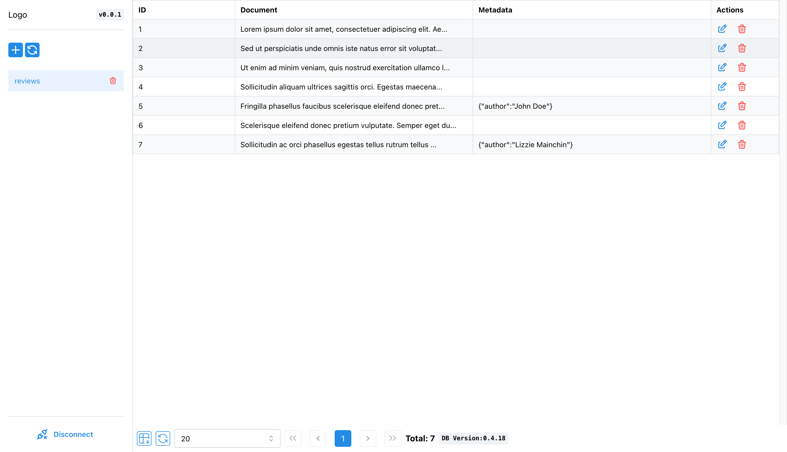
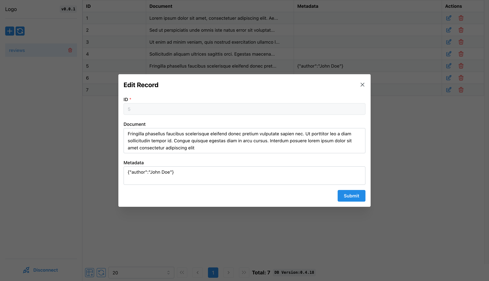

# Chroma UI

This is not an official project. Initially, I developed this for myself because it was getting difficult for me check the collections and records through code and APIs can be overwhelming as I am used to access the database using GUI tools like DBeaver, MongoDB Compass etc. So here, I have open sourced it in case someone also feeling the same. It is also hosted at https://chroma-ui.vercel.app and source code is hosted at https://github.com/thakkaryash94/chroma-ui.

## Screenshots
- List

- Edit

## Use

There are 2 ways to use the tool.
1. You can go to https://chroma-ui.vercel.app and enter your Chroma DB UI URL. Note: It will work only with live URLs and won't work for localhost(127.0.0.1).
2. If you want to use it for local development, follow setup steps.

## Setup

This project is built using NextJS, React, Mantine. You don't need familiarity with them if you just want to use it. Follow below steps to run the application.

**Prerequisites**: NodeJS

1. Clone the repo
2. Run `npm install` to install the dependencies
3. Run `npm run dev` to start the application
OR
3. Run `npm run build` to build the project
4. Run `npm run start` to run the application

## Help Links

Here are resource links

- [ChromaDB](https://www.trychroma.com/)
- [NextJS](https://nextjs.org/)
- [Mantine](https://mantine.dev/)
- [React Query](https://tanstack.com/query/v5)
